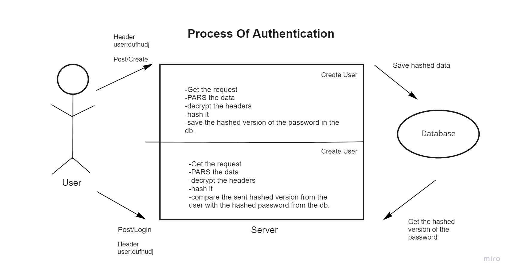
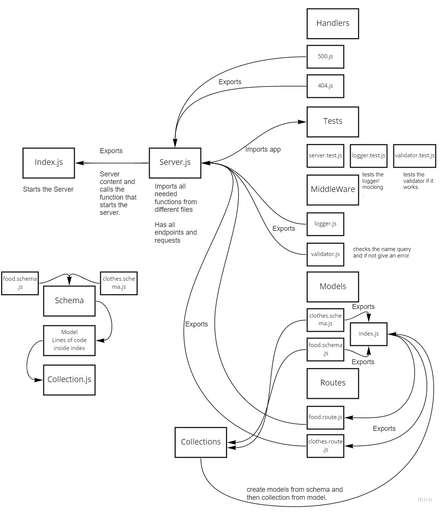

# basic-auth
## LAB - 06
### Authentication 
Author: Sana Ishaqat

[tests report (actions)](https://github.com/SanaIshaqat/basic-auth/actions)

[back-end (heroku proof of life)](https://sana-basic-auth-401.herokuapp.com/alive)

[back-end (non-exist routes)](https://sana-basic-auth-401.herokuapp.com/bla)
[back-end (Error)](https://sana-basic-auth-401.herokuapp.com/error)

[PR Link](https://github.com/SanaIshaqat/basic-auth/pull/1)

[Final PR](https://github.com/SanaIshaqat/basic-auth/pull/3)
### Setup
.env requirements
PORT - Port Number

### Running the app
npm run dev
Endpoint: /status
Returns Object
{
  "status": "running",
  "port": 3030,
  "domain": "https://sana-basic-auth-401.herokuapp.com"
}

### Tests
Unit Tests: npm run test

UML

